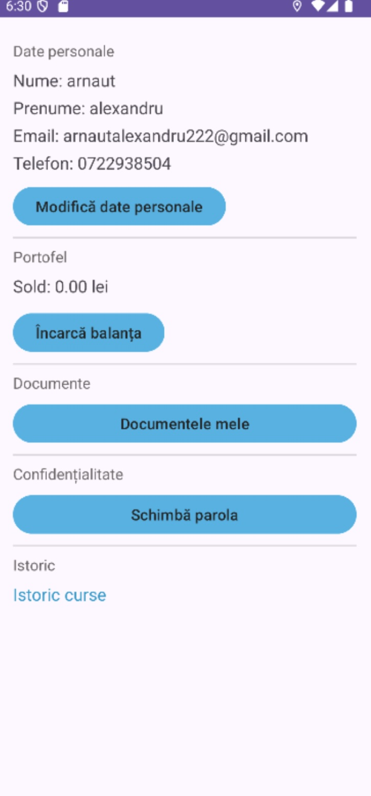

# CarSharing Android App

A native Android car sharing application built in Java as a university thesis project. The app allows users to locate available vehicles on an interactive map, view their details and pricing, make a reservation, and track the active ride in real time.

---

## Screenshots

<p align="center">
  
  
  
  
</p>

---

## Features

- User authentication via Firebase (login, registration, logout)
- Interactive Google Maps view showing available vehicles as markers across Bucharest
- Bottom sheet panel displaying vehicle details: brand, model, body type, seats, engine, fuel type, and range
- Pricing plans selectable per reservation: per minute, per hour, 12 hours, or 24 hours
- Pre-ride vehicle verification step before a trip begins
- Active ride screen with a live timer and real-time cost counter
- Ride data saved to a backend REST API upon trip completion
- User profile screen showing personal details, wallet balance, document management, and ride history

---

## Project Structure

```
app/src/main/java/com/example/carsharingapp/
├── MainActivity.java               # Map screen, vehicle markers, bottom sheet
├── LoginActivity.java              # Firebase email/password login
├── RegisterActivity.java           # New user registration
├── RezervareActivity.java          # Pricing plan selection
├── VerificareVehiculActivity.java  # Pre-trip vehicle check
├── CursaActivity.java              # Active ride timer and cost tracker
├── ListaVehiculeActivity.java      # List view of available vehicles
├── ProfilActivity.java             # User profile and wallet
├── adapter/
│   └── VehiculAdapter.java         # RecyclerView adapter for vehicle list
├── model/
│   ├── Vehicul.java                # Vehicle data model
│   └── Cursa.java                  # Ride data model
└── network/
    ├── ApiClient.java              # Retrofit client setup
    ├── VehiculApi.java             # Vehicle API endpoints
    └── CursaApi.java               # Ride API endpoints
```

---

## Notes

- The backend (Spring Boot REST API) is a separate project and must be running for vehicle data and ride saving to function.
- The app is currently targeting Bucharest as the default map region.